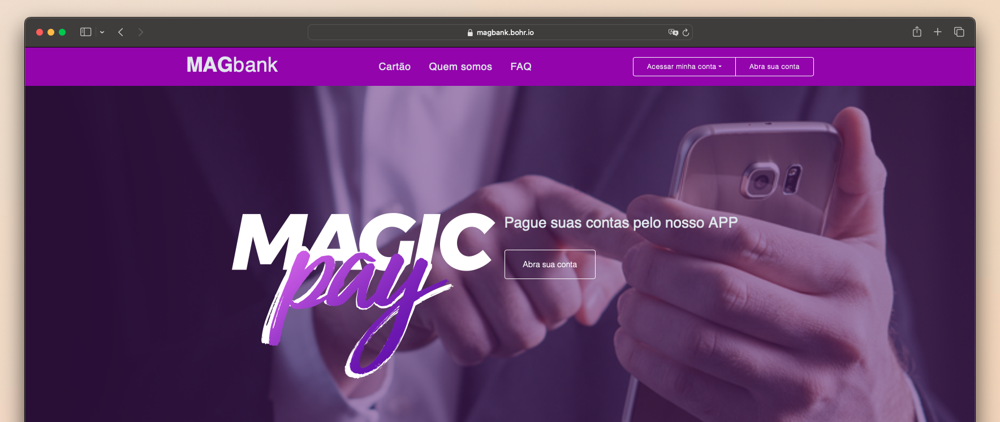

# MAGBANK

This application was developed during the Global Dev course at Imagine School using React, Vite, Sass, and Bootstrap.

In addition, the development was guided by some Mobile First concepts.


## Running Locally

After cloning the repository, access the project folder and run the following commands:

```sh
yarn
yarn dev
```

In another terminal tab, run the command below to start the JSON-Server API:

```sh
yarn db
```

Access <http://localhost:5173> to view the application.
